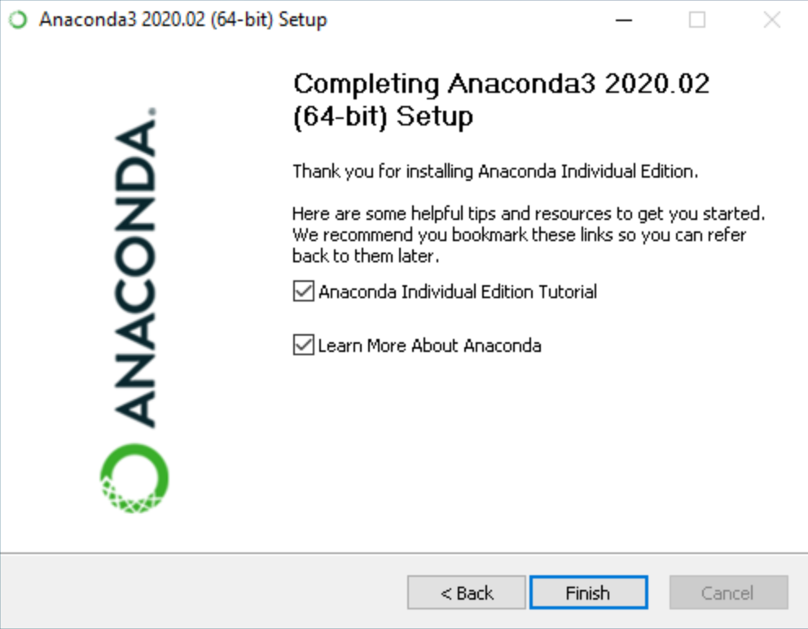

# How to install Python

> This document provide a relatively brief overview of how to install Python in your machine. 

# OPTION 1: ANACONDA

### Install

Python runs on windows, linux, mac and other environments. There are many python distributions available. However the recommended way to install python under Microsoft Windows or Linux is to use the Anaconda distribution available at [https://www.anaconda.com/products/individual#windows]. If you are installing python from elsewhwer, make sure you get at least Python *3.8* version, not 2.7. The Anaconda distribution comes with the **[SciPy](https://www.scipy.org/)** collection of scientific python tools as well as the iron python notebook. For developing python code without notebooks consider using **[spyder](https://github.com/spyder-ide/spyder)** (also included with Anaconda) or your favourite IDE under windows, mac etc (e.g. **[Visual Studio Code](https://code.visualstudio.com/docs/languages/python)** which handles both plain python programs and notebooks) 

### Steps:

1. Download the “Anaconda” **[installer](https://www.anaconda.com/products/individual#windows)**.

Scroll to the bottom of the page and click the “Windows” option just above the downloads.


I recommend getting a 64-bit version, as long as your computer is 64-bit.

2. Double click and Run the Anaconda installer

3. Click Next.

4. Read the licensing terms and click “I Agree”.

5. Select an install for “Just Me” unless you’re installing for all users (which requires Windows Administrator privileges) and click Next.

6. Select a destination folder to install Anaconda and click the Next button.


7. Choose whether to add Anaconda to your PATH environment variable. I recommend not adding Anaconda to the PATH environment variable, since this can interfere with other previously installed Python version. Instead, use Anaconda software by opening Anaconda Navigator or the Anaconda Prompt from the Start Menu. If installing python for first time check the first box.


8. Choose whether to register Anaconda as your default Python. Unless you plan on installing and running multiple versions of Anaconda or multiple versions of Python, accept the default and leave this box checked. 

9. Click the Install button. If you want to watch the packages Anaconda is installing, click Show Details.

10. Click the Next button.

11. Optional: To install PyCharm for Anaconda, click on the link to https://www.anaconda.com/pycharm.


Or to install Anaconda without PyCharm, click the Next button.

12. After a successful installation you will see the “Thanks for installing Anaconda” dialog box:



12. If you wish to read more about Anaconda Cloud and how to get started with Anaconda, check the boxes “Learn more about Anaconda Cloud” and “Learn how to get started with Anaconda”. Click the Finish button.

13. Verifying your installation
    - Anaconda Navigator

Anaconda Navigator is a graphical user interface that is automatically installed with Anaconda. Navigator will open if the installation was successful. If Navigator does not open, review our help resources.

**Windows**: Click Start, search or select Anaconda Navigator from the menu.


**macOS**: Click Launchpad, select Anaconda Navigator. Or, use Cmd+Space to open Spotlight Search and type “Navigator” to open the program.

**Linux**: See next section.

* Conda

If you prefer using a command line interface (CLI), you can use conda to verify the installation using Anaconda Prompt on Windows or terminal on Linux and macOS.

To open Anaconda Prompt:

**Windows**: Click Start, search, or select Anaconda Prompt from the menu.


**macOS**: Cmd+Space to open Spotlight Search and type “Navigator” to open the program.

**Linux–CentOS**: Open Applications - System Tools - terminal.

**Linux–Ubuntu**: Open the Dash by clicking the upper left Ubuntu icon, then type “terminal”.


After opening Anaconda Prompt or the terminal, choose any of the following methods to verify:

Enter **`conda list`**. If Anaconda is installed and working, this will display a list of installed packages and their versions.
Enter the command **`python`**. This command runs the Python shell. If Anaconda is installed and working, the version information it displays when it starts up will include “Anaconda”. To exit the Python shell, enter the command **`quit()`**.
Open Anaconda Navigator with the command **`anaconda-navigator`**. If Anaconda is installed properly, Anaconda Navigator will open.

* Open Jupyter Notebok

From Anaconda Navigator open Jupyter Notebook

or

To open a Jupyter Notebook with anaconda installed, from the Anaconda terminal run:

**`Jupyter Notebook`**

# OPTION 2: The Easiest Way to Run Python

The easiest way to run Python is by using **Thonny IDE**.

The Thonny IDE comes with the latest version of Python bundled in it. So you don't have to install Python separately.

Follow the following steps to run Python on your computer.

1. Download **[Thonny IDE](https://thonny.org/)**. 
2. Run the installer to install **Thonny** on your computer.
3. Go to: **File** > **New**. Then save the file with **`.py`** extension. For example, **`hello.py`**, **`example.py`**, etc. You can give any name to the file. However, the file name should end with **`.py`**


4. Write Python code in the file and save it.
5. Then Go to **Run** > **Run current script** or simply click **F5** to run it.

# OPTION 3: Install Python Separately (Windows)

If you don't want to use Thonny, here's how you can install and run Python on your computer.

1. Download the latest version of **[Python](https://www.python.org/downloads/)**.
Download Windows x86 – 64 executable file only as installer will automatically install 32 or 64 bit of Python according to the system configuration.

2. Run the installer file and follow the steps to install Python

3. During the install process, check Add Python to environment variables. This will **add Python to environment variables**, and you can run Python from any part of the computer.

Also, you can choose the path where Python is installed.


4. When the installation progress is completed, you will see the Disable path length limit. Now you must be thinking what is it and whats will happen if I will disable it. The answer is clear, it will remove the limitations on **MAX_PATH** variable. It will allow to use long path names for the Python. We recommend you to not disable this option as it will remove any path related issues while working in Windows. Therefore click on the close button to finish the installation.


5. Now, the Python is installed. You can check it either it is properly installed or not. You can do it through Command Prompt. Open the command prompt and type the following command -" **python -v** ". It will output the version of the Python.

6. Congratulation, you have **successfully** installed **Python 3** version. you can read the next tutorial to Python Programming a complete guide for beginners.

# Run Python

## 1. Run Python in Immediate mode

Once Python is installed, typing **`python`** in the command line will invoke the interpreter in immediate mode. We can directly type in Python code, and press Enter to get the output.

Try typing in **`1 + 1`** and press enter. We get **`2`** as the output. This prompt can be used as a calculator. To exit this mode, type **`quit()`** and press enter.


## 2. Run Python in the Integrated Development Environment (IDE)

We can use any text editing software to write a Python script file.

We just need to save it with the **`.py`** extension. But using an IDE can make our life a lot easier. IDE is a piece of software that provides useful features like code hinting, syntax highlighting and checking, file explorers, etc. to the programmer for application development.

By the way, when you install Python, an IDE named IDLE is also installed. You can use it to run Python on your computer. It's a decent IDE for beginners.

When you open IDLE, an interactive Python Shell is opened.


Now you can create a new file and save it with **.py** extension. For example, **hello.py**

Write Python code in the file and save it. To run the file, go to **Run** > **Run Module** or simply click **F5**.


#  Python 3 Major Version Installation (Linux)

Linux is an open source Operating System. There are many Linux based operating systems. Popular are **Ubuntu, Fedora, Linux Mint, Debian**. In this section you will learn how to do python installation for both Python 3 and Python 2 versions. **Fedora Linux OS** used for Installation of python. Most of the newer Linux based Operating system have **already installed Python**. You will check it is installed or not by the typing the following commands in terminal. 

* For Python3
 **`$ python3 --version`**

* For Python2
**`$ python2 --version`**

You will see the python versions as output like in the below screenshot. But if you are not seeing then , you have to install Python . Follow the following steps for **successful install**.


If you are using Ubuntu 16.0 or newer version, then you can easily install Python 3.6 or Python 2.7 by typing the following commands 

 **`$ sudo apt-get update`**

 **`$ sudo apt-get install python3.7`**

# Python 3 Major Version Installation (MacOS)

**MacOs** is an operating system developed by the Apple Inc. It is just like Windows Operating System and other operating system. Most of the newer versions of MacOS have **pre-installed python**. You can check python is installed or not by the following commands. 

python --version

Download the Python 3 or 2 new version. At the time of writing this post , **Python 3.12.4 - June 8, 2024** was the newer version. Download the **[Mac OS X 64-bit/32-bit](https://www.python.org/downloads/mac-osx/)** installer. Run the package and following the installation steps to install the python packages

After the **successful installation**, you can check the python version by using the same command.

 **`python --version`**


```py
print(5 + 7)
```

```py
print(11 + 23)
```
