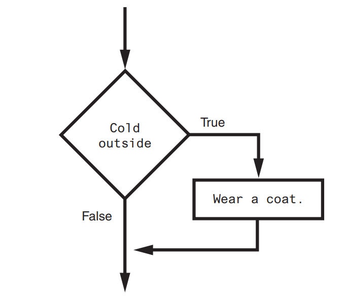
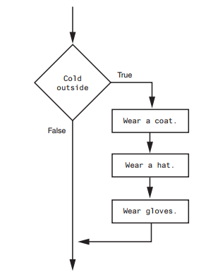
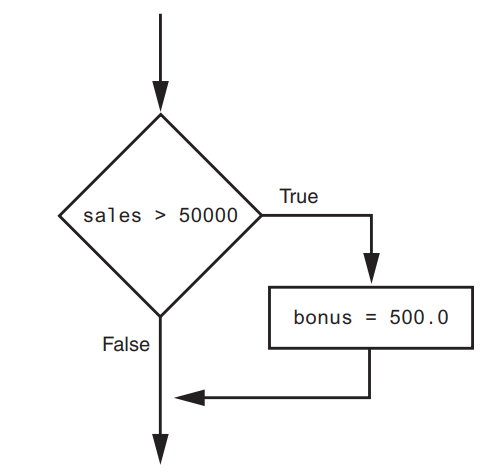
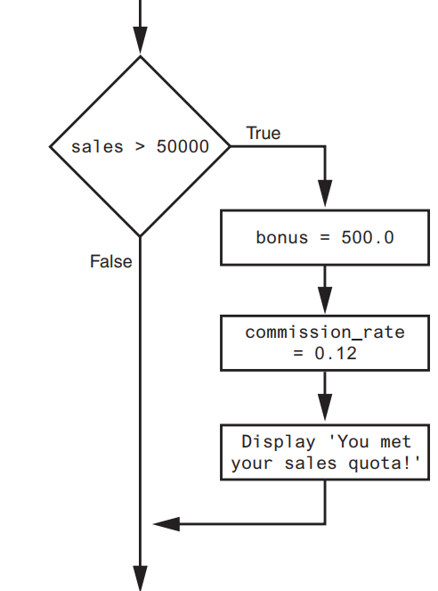
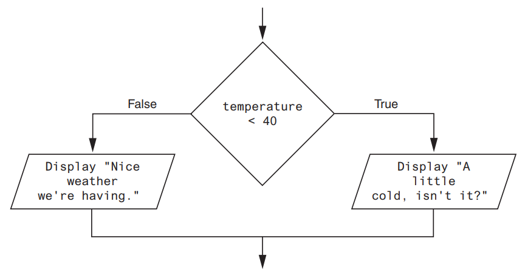
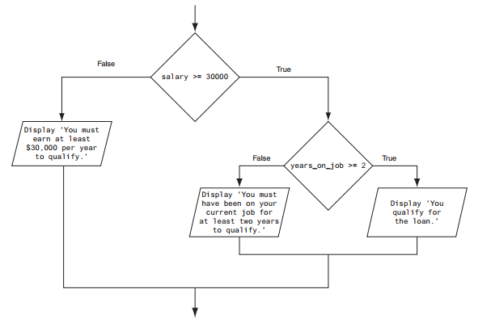

## Decision Structures and Boolean Logic

### TOPICS

- The if Statement
- The if-else Statement
- Comparing Strings
- Nested Decision Structures and the if-elif-else Statement
- Logical Operators
- Boolean Variables


### The if Statement
The `if statement` is used to create a decision structure, which allows a program to have more than one path of execution. The if statement causes one or more statements to execute only when a Boolean expression is true.

A  `control structure` is a logical design that controls the order in which a set of statements execute. So far in this note, we have used only the simplest type of control structure: the sequence structure.
 
A `sequence structure` is a set of statements that execute in the order in which they appear. For example, the following code is a sequence structure because the statements execute from top to bottom:

```python
name = "Alpha"
age = 12
print(f"My name is:{name}")
print(f"My age is: {age}")
```
Output 
```
My name is: Alpha
My age is: 12
```
# Example 2
```python
name = input("Enter name: ")
age = int(input("Enter your age: "))
```

print(f"My name is: {name}")
print(f"My age is: {age}")
```python
name = input('What is your name? ')
age = int(input('What is your age? '))
print('Here is the data you entered:')
print('Name:', name)
print('Age:', age)
```

  
- In the flowchart, the diamond symbol indicates some condition that must be tested. 
- In this case, we are determining whether the condition Cold outside is true or false. 
- If this condition is true, the action Wear a coat is performed. If the condition is false, the action is skipped.
 - The action is conditionally executed because it is performed only when a certain condition is true.
- In Python, we use the if statement to write a single alternative decision structure. Here is the general format of the if statement:
 ```python 
        if condition:
            statement
            statement
            etc.
  ```
  
- For simplicity, we will refer to the first line as the if clause. The if clause begins with the word if, followed by a condition, which is an expression that will be evaluated as either true or false. A colon appears after the condition. Beginning at the next line is a block of statements.
 - A `block ` is simply a set of statements that belong together as a group. Notice in the general format that all of the statements in the block are indented.
  - This indentation is required because the Python interpreter uses it to tell where the block begins and ends.
- When the if statement executes, the condition is tested. If the condition is true, the statements that appear in the block following the if clause are executed. 
- If the condition is false, the statements in the block are skipped.

```python
isColdOutside = True 

if isColdOutside:
    print("Wear a coat")
    print("Wear a hat")
```

## Exercise
- Try changing the `isColdOutside` to **False**
```
isColdOutside = True

if isColdOutside:
    print("Wear a coat")
    print("Wear a hat")
```
## Boolean Expressions and Relational Operators

- The expressions that are tested by the if statement are called Boolean expressions, named in honor of the English mathematician George Boole
- A relational operator determines whether a specific relationship exists between two values. For example, the greater than operator (\>) determines whether one value is greater than another. 
- The equal to operator (==) determines whether two values are equal.

| Operator | Meaning                  |
|----------|--------------------------|
| &gt;      | Greater than             |
| &lt;      | Less than                |
| &gt;=     | Greater than or equal to |
| &lt;=     | Less than or equal to    |
| ==       | Equal to                 |
| !=       | Not equal to             |
           |

| Expression  | Meaning                               |
|-------------|---------------------------------------|
| x \> y      | Is x greater than y?                  |
| x \< y      | Is x less than y?                     |
| x \>= y     | Is x greater than or equal to y?      |
| x \<= y     | Is x less than or equal to y?         |
| x == y      | Is x equal to y?                      |
| x !=


### Example 1
```python
x = 10
y = 5

print(x > y)  # True
print(x < y)  # False
print(x >= y)  # True
print(x <= y)  # False
print(x == y)  # False
print(x != y)  # True

```
Output
```
True
False
True
False
False
True
```
### Example 2:
```python
age = 18
if age >= 18:
    print("Welcome")
```

## Example 3:
```python
sales = int(input(f'Enter sales amount: '))
if sales > 50000:
    bonus = 500.0
```
### Example 4:
```python
choice = int(input('Enter your choice: '))
if choice != 5:
    print('I love Rugiatu')
```

### Example 5
```python
name = input("Enter your name: ")
age = int(input("Enter your age: "))

# <, > , >=, <=
if age >= 18:
    print(f"Welcome: {name}")
```
Output
```
Sample name = Fatima
age = 20

Enter your name: Fatima
Enter your age: 20
Welcome: Fatima
```
### Example 6
- This statement uses the `>` operator to determine whether sales is greater than 50,000. 
- If the expression `sales > 50000` is true, the variable bonus is assigned `500.0`. 
- If the expression is false, however, the assignment statement is skipped. Figure below shows a flowchart for this section of code.


### Example 8
- The following example conditionally executes a block containing three statements. Figure below shows a flowchart for this section of code:



```python
if sales > 50000:
    bonus = 500.0
    commission_rate = 0.12
    print('You met your sales quota!')
```

### Example 9
The following code uses the `== ` operator to determine whether two values are equal. The
expression `balance == 0` will be true if the balance variable is assigned 0. Otherwise, the expression will be false.

```python
balance = 10
if balance == 0:
    # Statements appearing here will
    # be executed only if balance is
    # equal to 0.
```
### Example 10
The following code uses the != operator to determine whether two values are not equal. The expression choice != 5 will be true if the choice variable does not reference the value 5. Otherwise, the expression will be false.

```python
choice = int(input('Enter your choice: '))
if choice != 5:
    print('I love Rugiatu')
```
```I love Rugiatu```

## In the Spotlight:
### Using the if Statement
Alpha Leigh teaches a science class and his students are required to take three tests. He wants to write a program that his students can use to calculate their average test score. He  also wants the program to congratulate the student enthusiastically if the average is greater than 95. Here is the algorithm in pseudocode:
```
- Get the first test score
- Get the second test score
- Get the third test score
- Calculate the average
- Display the average
- If the average is greater than 95:
    - Congratulate the user
 
- This program gets three test scores and displays their average. It congratulates the user if the average is a high score.
- The HIGH_SCORE named constant holds the value that is considered a high score.
```


### Get the three test scores
```python
HIGHEST_SCORE = 95
test_one = float(input("Enter score 1: "))
test_two = float(input("Enter score 2: "))
test_three = float(input("Enter score 3: "))

average = (test_one + test_two + test_three) / 3

if average >= HIGHEST_SCORE:
    print(f'Congratulations! Your average is: {average:.2f}')
```
## Exercises
1. What is a control structure?
2. What is a decision structure?
3. What is a single alternative decision structure?
4. What is a Boolean expression?
5. What types of relationships between values can you test with relational operators?
6. Write an if statement that assigns `0 to x if y is equal to 20`.
7. Write an if statement that assigns `0.2` to commissionRate if sales is greater than or equal to 10000.
## The if-else Statement
An if-else statement will execute one block of statements if its condition is true, or another block if its condition is false.

## Dual Alternative
- Dual alternative decision structure, two possible paths of execution—one path is taken if a condition
is true, and the other path is taken if the condition is false



In code, we write a dual alternative decision structure as an if-else statement. Here is the
general format of the if-else statement:
```python
    if condition:
        statement
        statement
        etc.
    else:
        statement
        statement
        etc.
```
### In the Spotlight:
### Using the if-else Statement
Alpha owns an auto repair business and has several employees. If any employee works over 40 hours in a week, he pays them 1.5 times their regular hourly pay rate for all hours over 40. He has asked you to design a simple payroll program that calculates an employee’s gross pay, including any overtime wages. You design the following algorithm:

- Get the number of hours worked.
- Get the hourly pay rate.
- If the employee worked more than 40 hours:
    Calculate and display the gross pay with overtime.
- Else:
    Calculate and display the gross pay as usual.

```python
# Named constants to represent the base hours and
# the overtime multiplier.
BASE_HOURS = 40 # Base hours per week
OT_MULTIPLIER = 1.5 # Overtime multiplier

# Get the hours worked and the hourly pay rate.
hours = float(input('Enter the number of hours worked: '))
pay_rate = float(input('Enter the hourly pay rate: '))

# Calculate and display the gross pay.
if hours > BASE_HOURS:
    # Calculate the gross pay with overtime.
    # First, get the number of overtime hours worked.
    overtime_hours = hours - BASE_HOURS
    
    # Calculate the amount of overtime pay.
    overtime_pay = overtime_hours * pay_rate * OT_MULTIPLIER
    
    # Calculate the gross pay.
    gross_pay = BASE_HOURS * pay_rate + overtime_pay

else:
    # Calculate the gross pay without overtime.
    gross_pay = hours * pay_rate
    
    # Display the gross pay.
    print(f'The gross pay is ${gross_pay:,.2f}.')

```
## Exercises
1. How does a dual alternative decision structure work?
2. What statement do you use in Python to write a dual alternative decision structure?
3. When you write an if-else statement, under what circumstances do the statements that appear after the else clause execute?

### Comparing Strings
#### CONCEPT: Python allows you to compare strings. This allows you to create decision structures that test the value of a string.

```python
name1 = 'Alpha'
name2 = 'Rugiatu'
if name1 == name2:
    print('The names are the same.')
else:
    print('The names are NOT the same.')
```
The `==` operator compares name1 and name2 to determine whether they are equal. Because the strings 'Mary' and 'Mark' are not equal, the else clause will display the   message 'The names are NOT the same.

```python
month = "July"
if month != 'October': 
    print('This is the wrong time for October fest!')
```
```This is the wrong time for October fest!```
```python
# This program compares two strings.
# Get a password from the user.
password = input('Enter the password: ')

# Determine whether the correct password
# was entered.
if password == 'rugiatu':
    print('Password accepted.')
else:
    print('Sorry, that is the wrong password.')
```
```Sorry, that is the wrong password.```

```python
# This program compares strings with the < operator.
# Get two names from the user.
name1 = input('Enter a name (last name first): ')
name2 = input('Enter another name (last name first): ')

# Display the names in alphabetical order.
print('Here are the names, listed alphabetically.')

if name1 < name2:
    print(name1)
    print(name2)
else:
    print(name2)
    print(name1)
```

```
1. What would the following code display?
   ```python
    if 'z' < 'a':
        print('z is less than a.')
    else:
        print('z is not less than a.')
   ```
3. What would the following code display?
   ```python
    s1 = 'Mayakie'
    s2 = 'Mambolo'
    
    if s1 > s2:
        print(s2)
        print(s1)
    else:
        print(s1)
        print(s2)
        ```
   ```

### Nested Decision Structures and the if-elif-else Statement
CONCEPT: To test more than one condition, a decision structure can be nested inside another decision structure.


If we follow the flow of execution, we see that the condition salary >= 30000 is tested. If this condition is false, there is no need to perform further tests; we know the customer does not qualify for the loan. If the condition is true, however, we need to test the second condition. This is done with a nested decision structure that tests the condition years_on_job `>= 2`. If this condition is true, then the customer qualifies for the loan. If this condition is false, then the customer does not qualify

```python
# This program determines whether a bank customer
# qualifies for a loan.

MIN_SALARY = 30000.0 # The minimum annual salary
MIN_YEARS = 2 # The minimum years on the job

# Get the customer's annual salary.
salary = float(input('Enter your annual salary: '))
# Get the number of years on the current job.
years_on_job = int(input('Enter the number of ' + 'years employed: '))

# Determine whether the customer qualifies.
if salary >= MIN_SALARY:
    if years_on_job >= MIN_YEARS:
        print('You qualify for the loan.')
    else:
        print(f'You must have been employed for at least {MIN_YEARS} years to qualify.')
else:
    print(f'You must earn at least Le {MIN_SALARY:,.2f} per year to qualify.')
```

### Logical Operators
CONCEPT: The logical and operator and the logical or operator allow you to connect multiple Boolean expressions to create a compound expression. The logical not operator reverses the truth of a Boolean expression.

| Expression            | Meaning                                    |
|-----------------------|--------------------------------------------|
| x \> y and a \< b     | Is x greater than y AND is a less than b? |
| x == y or x == z      | Is x equal to y OR is x equal to z?       |
| not (x \> y)           | Is the expression x \> y NOT true?         |


## Compound Boolean expressions using logical operators


The and Operator
The and operator takes two Boolean expressions as operands and creates a compound Boolean expression that is true only when both subexpressions are true. The following is an example of an if statement that uses the and operator:

 ```
if temperature < 20 and minutes > 12:
      print('The temperature is in the danger zone.')
 ```
         
In this statement, the two Boolean expressions `temperature < 20 and minutes > 12` are combined into a compound expression. The print function will be called only if temperature is less than 20 and minutes is greater than 12
## The and Operator
The and operator takes two Boolean expressions as operands and creates a compound Boolean expression that is true only when both subexpressions are true. The following is an example of an if statement that uses the and operator:
``` 
    if temperature < 20 and minutes > 12:
        print('The temperature is in the danger zone.')
```
In this statement, the two Boolean expressions `temperature < 20 and minutes > 12` are combined into a compound expression. The print function will be called only if temperature is less than 20 and minutes is greater than 12

## The or Operator
The `or` operator takes two Boolean expressions as operands and creates a compound Boolean expression that is true when either of the subexpressions is true. The following is an example of an if statement that uses the or operator:
```
if temperature < 20 or temperature > 100:
  print('The temperature is too extreme')
``` 
## The not Operator
The not operator is a unary operator that takes a Boolean expression as its operand and
reverses its logical value. In other words, if the expression is true, the not operator returns
false, and if the expression is false, the not operator returns true. The following is an if
statement using the not operator:
```
if not(temperature > 100):
    print('This is below the maximum temperature.')
```
First, the expression (temperature \> 100) is tested and a value of either true or false is
the result. Then the not operator is applied to that value. If the expression (temperature \> 100) is true, the not operator returns false. If the expression (temperature > 100) is false, the not operator returns true. The previous code is equivalent to asking: “Is the temperature not greater than 100?”

```python
# This program determines whether a bank customer
# qualifies for a loan.

MIN_SALARY = 30000.0 # The minimum annual salary
MIN_YEARS = 2 # The minimum years on the job

# Get the customer's annual salary.
salary = float(input('Enter your annual salary: '))

# Get the number of years on the current job.
years_on_job = int(input('Enter the number of ' +'years employed: '))

# Determine whether the customer qualifies.
if salary >= MIN_SALARY and years_on_job >= MIN_YEARS:
    print('You qualify for the loan.')
else:
    print('You do not qualify for this loan.')
```
```python
# This program determines whether a bank customer
# qualifies for a loan.

MIN_SALARY = 30000.0 # The minimum annual salary
MIN_YEARS = 2 # The minimum years on the job

# Get the customer's annual salary.
salary = float(input('Enter your annual salary: '))

# Get the number of years on the current job.
years_on_job = int(input('Enter the number of  + years employed: '))
# Determine whether the customer qualifies.
if salary >= MIN_SALARY or years_on_job >= MIN_YEARS:
    print('You qualify for the loan.')
else:
    print('You do not qualify for this loan.')

```
## EXERCISES
1. What is a compound Boolean expression?
2. The following truth table shows various combinations of the values true and false
connected by a logical operator. Complete the table by circling T or F to indicate
whether the result of such a combination is true or false.

| Logical Expression | Result (circle T or F) |
|--------------------|-------------------------|
| True and False     | F                       |
| True and True      | T                       |
| False and True     | F                       |
| False and False    | F                       |
| True or False      | T                       |
| True or True       | T                       |
| False or True      | T                       |
| False or False     | F                       |
| not True           | F                       |
| not False          | T                       |
3. Assume the variables a = 2, b = 4, and c = 6. Circle T or F for each of the following conditions to indicate whether its value is true or false.

| Condition                   | Result (circle T or F) |
|-----------------------------|-------------------------|
| a == 4 or b \> 2             | T                       |
| 6 \<= c and a \> 3            | F                       |
| 1 != b and c != 3           | F                       |
| a \>= −1 or a \<= b           | T                       |
| not (a \> 2)                 | T                       |


4. Explain how short-circuit evaluation works with the and and or operators.
5. Write an if statement that displays the message “The number is valid” if the value referenced by speed is within the range 0 through 200.
6. Write an if statement that displays the message “The number is not valid” if the value referenced by speed is outside the range 0 through 200.

### Programming Exercises
1. Day of the Week
   
Write a program that asks the user for a number in the range of 1 through 7. The program should display the corresponding day of the week, where 1 = Monday, 2 = Tuesday, 3 = Wednesday, 4 = Thursday, 5 = Friday, 6 = Saturday, and 7 = Sunday. The program should display an error message if the user enters a number that is outside the range of 1 through 7.

3. Areas of Rectangles
   
The area of a rectangle is the rectangle’s length times its width. Write a program that asks for the length and width of two rectangles. The program should tell the user which rectangle has the greater area, or if the areas are the same.

4. Age Classifier
   
Write a program that asks the user to enter a person’s age. The program should display a message indicating whether the person is an infant, a child, a teenager, or an adult. Following are the guidelines:
- If the person is 1 year old or less, he or she is an infant.
- If the person is older than 1 year, but younger than 13 years, he or she is a child.
- If the person is at least 13 years old, but less than 20 years old, he or she is a teenager.
- If the person is at least 20 years old, he or she is an adult.
  
4. Roman Numerals
   
Write a program that prompts the user to enter a number within the range of 1 through 10. The program should display the Roman numeral version of that number. If the number is outside the range of 1 through 10, the program should display an error message. The following table shows the Roman numerals for the numbers 1 through 10:

| Number | Roman Numeral |
|--------|---------------|
| 1      | I             |
| 2      | II            |
| 3      | III           |
| 4      | IV            |
| 5      | V             |
| 6      | VI            |
| 7      | VII           |
| 8      | VIII          |
| 9      | IX            |
| 10     | X             |


5. Mass and Weight
   
Scientists measure an object’s mass in kilograms and its weight in newtons. If you know the amount of mass of an object in kilograms, you can calculate its weight in newtons with the following formula:
```math
$$weight = mass \times 9.8$$
```
6. Write a program that asks the user to enter an object’s mass, then calculates its weight. If the object weighs more than 500 newtons, display a message indicating that it is too heavy. If the object weighs less than 100 newtons, display a message indicating that it is too light.

7. Magic Dates
   
The date June 10, 1960, is special because when it is written in the following format, the month times the day equals the year:
`6/10/60`
Design a program that asks the user to enter a month (in numeric form), a day, and a twodigit year. The program should then determine whether the month times the day equals the
year. If so, it should display a message saying the date is magic. Otherwise, it should display a message saying the date is not magic.

8. Color Mixer
   
The colors red, blue, and yellow are known as the primary colors because they cannot be made by mixing other colors. When you mix two primary colors, you get a secondary color, as shown here:
- When you mix red and blue, you get purple.
- When you mix red and yellow, you get orange.
- When you mix blue and yellow, you get green.
Design a program that prompts the user to enter the names of two primary colors to mix. If the user enters anything other than “red,” “blue,” or “yellow,” the program should display an error message. Otherwise, the program should display the name of the secondary color that results.

9. Hot Dog Cookout Calculator
   
Assume hot dogs come in packages of 10, and hot dog buns come in packages of 8. Write a program that calculates the number of packages of hot dogs and the number of packages of hot dog buns needed for a cookout, with the minimum amount of leftovers. The program should ask the user for the number of people attending the cookout and the number of hot
dogs each person will be given. The program should display the following details:
• The minimum number of packages of hot dogs required
• The minimum number of packages of hot dog buns required
• The number of hot dogs that will be left over
• The number of hot dog buns that will be left over

10. Roulette Wheel Colors
    
On a roulette wheel, the pockets are numbered from 0 to 36. The colors of the pockets are as follows:
• Pocket 0 is green.
• For pockets 1 through 10, the odd-numbered pockets are red and the even-numbered pockets are black.
• For pockets 11 through 18, the odd-numbered pockets are black and the even-numbered pockets are red.
• For pockets 19 through 28, the odd-numbered pockets are red and the even-numbered pockets are black.
• For pockets 29 through 36, the odd-numbered pockets are black and the even-numbered pockets are red.
Write a program that asks the user to enter a pocket number and displays whether the pocket is green, red, or black. The program should display an error message if the user enters a number that is outside the range of 0 through 36.

11. Money Counting Game

Create a change-counting game that gets the user to enter the number of coins required to make exactly one dollar. The program should prompt the user to enter the number of pennies, nickels, dimes, and quarters. If the total value of the coins entered is equal to one dollar, the program should congratulate the user for winning the game. Otherwise, the
program should display a message indicating whether the amount entered was more than or less than one dollar.

13. Book Club Points
    
Serendipity Booksellers has a book club that awards points to its customers based on the number of books purchased each month. The points are awarded as follows:
- If a customer purchases 0 books, he or she earns 0 points.
- If a customer purchases 2 books, he or she earns 5 points.
- If a customer purchases 4 books, he or she earns 15 points.
- If a customer purchases 6 books, he or she earns 30 points.
- If a customer purchases 8 or more books, he or she earns 60 points.
Write a program that asks the user to enter the number of books that he or she has purchased this month, then displays the number of points awarded.

12. Software Sales
    
A software company sells a package that retails for Le99. Quantity discounts are given
according to the following table:

| Quantity Range | Discount |
|----------------|----------|
| 10–19          | 10%      |
| 20–49          | 20%      |
| 50–99          | 30%      |
| 100 or more    | 40%      |

a) Write a program that asks the user to enter the number of packages purchased. The program should then display the amount of the discount (if any) and the total amount of the purchase after the discount.


13. Shipping Charges
    
The Fast Freight Shipping Company charges the following

| Weight of Package                      | Rate per Pound |
|----------------------------------------|----------------|
| 2 pounds or less                       | Le1.50          |
| Over 2 pounds but not more than 6 pounds | Le3.00          |
| Over 6 pounds but not more than 10 pounds | Le4.00          |
| Over 10 pounds                         | Le4.75          |

b) Write a program that asks the user to enter the weight of a package and then displays the shipping charges.

14. Body Mass Index
    
Write a program that calculates and displays a person’s body mass index (BMI). The BMI is often used to determine whether a person is overweight or underweight for his or her height. A person’s BMI is calculated with the following formula:
**BMI** is calculated using the formula:
```math
 $$BMI  = \frac{\text{weight} \times 703}{\text{height}^2}$$
```
Where:
- **weight** is measured in pounds.
- **height** is measured in inches.

where weight is measured in pounds and height is measured in inches. The program should ask the user to enter his or her weight and height, and then display the user’s BMI. The program should also display a message indicating whether the person has optimal weight, is underweight, or is overweight. A person’s weight is considered to be optimal if his or her BMI is between 18.5 and 25. If the BMI is less than 18.5, the person is considered to be underweight. If the BMI value is greater than 25, the person is considered to be overweight.

15. Time Calculator
    
Write a program that asks the user to enter a number of seconds and works as follows:
- There are 60 seconds in a minute. If the number of seconds the user enters is greater than or equal to 60, the program should convert the number of seconds to minutes and seconds.
- There are 3,600 seconds in an hour. If the number of seconds the user enters is greater than or equal to 3,600, the program should convert the number of seconds to hours, minutes, and seconds.
- There are 86,400 seconds in a day. If the number of seconds the user enters exceeds 86,400, the program should convert the number of seconds to days, hours, minutes, and seconds.
  
16. February Days
    
The month of February normally has 28 days. But if it is a leap year, February has 29 days. Write a program that asks the user to enter a year. The program should then display the number of days in February that year. Use the following criteria to identify leap years:
- Determine whether the year is divisible by 100. If it is, then it is a leap year if and only if it is also divisible by 400. For example, 2000 is a leap year, but 2100 is not.
- If the year is not divisible by 100, then it is a leap year if and only if it is divisible by 4. For example, 2008 was a leap year, but 2009 was not.

- Here is a sample run of the program:
    - Enter a year: 2008 Enter
    - In 2008 February had 29 days.
