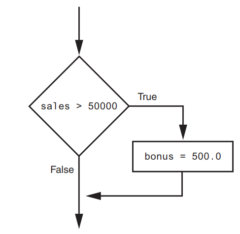
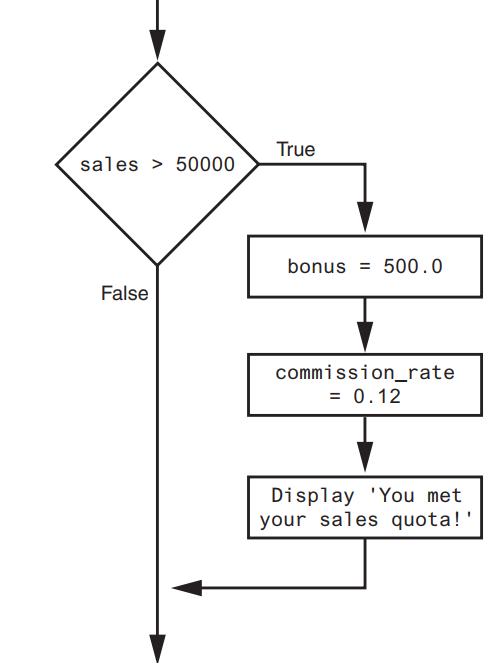
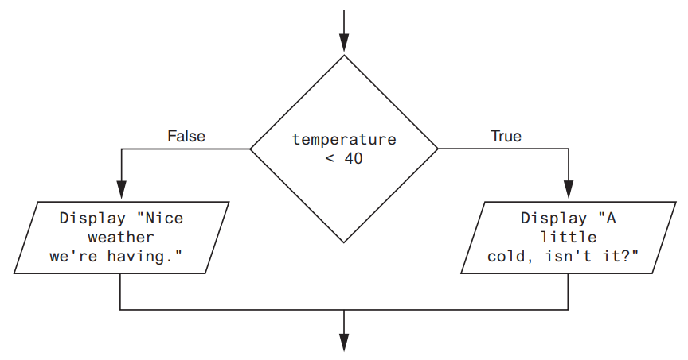

## Decision Structures and Boolean Logic

### TOPICS

- The if Statement
- The if-else Statement
- Comparing Strings
- Nested Decision Structures and the if-elif-else Statement
- Logical Operators
- Boolean Variables


### The if Statement
The `if statement` is used to create a decision structure, which allows a program to have more than one path of execution. The if statement causes one or more statements to execute only when a Boolean expression is true.

A  `control structure` is a logical design that controls the order in which a set of statements execute. So far in this book, we have used only the simplest type of control structure: the sequence structure.
 
A `sequence structure` is a set of statements that execute in the order in which they appear. For example, the following code is a sequence structure because the statements execute from top to bottom:
```python
name = input('What is your name? ')
age = int(input('What is your age? '))
print('Here is the data you entered:')
print('Name:', name)
print('Age:', age)
```

  
- In the flowchart, the diamond symbol indicates some condition that must be tested. 
- In this case, we are determining whether the condition Cold outside is true or false. 
- If this condition is true, the action Wear a coat is performed. If the condition is false, the action is skipped.
 - The action is conditionally executed because it is performed only when a certain condition is true.
- In Python, we use the if statement to write a single alternative decision structure. Here is the general format of the if statement:
 ```python 
        if condition:
            statement
            statement
            etc.
  ```
  
- For simplicity, we will refer to the first line as the if clause. The if clause begins with the word if, followed by a condition, which is an expression that will be evaluated as either true or false. A colon appears after the condition. Beginning at the next line is a block of statements.
 - A `block ` is simply a set of statements that belong together as a group. Notice in the general format that all of the statements in the block are indented.
  - This indentation is required because the Python interpreter uses it to tell where the block begins and ends.
- When the if statement executes, the condition is tested. If the condition is true, the statements that appear in the block following the if clause are executed. 
- If the condition is false, the statements in the block are skipped.

## Boolean Expressions and Relational Operators

- The expressions that are tested by the if statement are called Boolean expressions, named in honor of the English mathematician George Boole
- A relational operator determines whether a specific relationship exists between two values. For example, the greater than operator (>) determines whether one value is greater than another. 
- The equal to operator (==) determines whether two values are equal.

| Operator | Meaning                  |
|----------|--------------------------|
| >        | Greater than             |
| <        | Less than                |
| >=       | Greater than or equal to |
| <=       | Less than or equal to    |
| ==       | Equal to                 |
| !=       | Not equal to             |

| Expression | Meaning                      |
|------------|------------------------------|
| x > y      | Is x greater than y?         |
| x < y      | Is x less than y?            |
| x >= y     | Is x greater than or equal to y? |
| x <= y     | Is x less than or equal to y?    |
| x == y     | Is x equal to y?             |
| x != y     | Is x not equal to y?         |

```python
sales = int(input(f'Enter sales amount: '))
if sales > 50000:
    bonus = 500.0
```

- This statement uses the `>` operator to determine whether sales is greater than 50,000. 
- If the expression `sales > 50000` is true, the variable bonus is assigned `500.0`. 
- If the expression is false, however, the assignment statement is skipped. Figure below shows a flowchart for this section of code.

- The following example conditionally executes a block containing three statements. Figure below shows a flowchart for this section of code:



```python
if sales > 50000:
    bonus = 500.0
    commission_rate = 0.12
    print('You met your sales quota!')
```

The following code uses the `== ` operator to determine whether two values are equal. The
expression `balance == 0` will be true if the balance variable is assigned 0. Otherwise, the expression will be false.

```python
balance = 10
if balance == 0:
    # Statements appearing here will
    # be executed only if balance is
    # equal to 0.
```
The following code uses the != operator to determine whether two values are not equal. The expression choice != 5 will be true if the choice variable does not reference the value 5. Otherwise, the expression will be false.

```python
choice = int(input('Enter your choice: '))
if choice != 5:
    print('I love Rugiatu')
```
```I love Rugiatu```

## In the Spotlight:
### Using the if Statement
Alpha Leigh teaches a science class and his students are required to take three tests. He wants to write a program that his students can use to calculate their average test score. He  also wants the program to congratulate the student enthusiastically if the average is greater than 95. Here is the algorithm in pseudocode:

- Get the first test score
- Get the second test score
- Get the third test score
- Calculate the average
- Display the average
- If the average is greater than 95:
    - Congratulate the user
 
- This program gets three test scores and displays their average. It congratulates the user if the average is a high score.
- The HIGH_SCORE named constant holds the value that is considered a high score.

**HIGH_SCORE = 95**

### Get the three test scores
- test1 = int(input('Enter the score for test 1: ' ))
- test2 = int(input('Enter the score for test 2: ' ))
- test3 = int(input('Enter the score for test 3: ' ))

### Calculate the average test score.
average = (test1 + test2 + test3) / 3

### Print the average.
print(f'The average score is {average}.')

### If the average is a high score, congratulate the user.
if average >= HIGH_SCORE:
    print('Congratulations!')
    print('That is a great average!')

## Exercises
1. What is a control structure?
2. What is a decision structure?
3. What is a single alternative decision structure?
4. What is a Boolean expression?
5. What types of relationships between values can you test with relational operators?
6. Write an if statement that assigns `0 to x if y is equal to 20`.
7. Write an if statement that assigns `0.2` to commissionRate if sales is greater than or equal to 10000.
## The if-else Statement
An if-else statement will execute one block of statements if its condition is true, or another block if its condition is false.

## Dual Alternative
- Dual alternative decision structure, two possible paths of execution—one path is taken if a condition
is true, and the other path is taken if the condition is false



In code, we write a dual alternative decision structure as an if-else statement. Here is the
general format of the if-else statement:
```python
    if condition:
        statement
        statement
        etc.
    else:
        statement
        statement
        etc.
```
### In the Spotlight:
### Using the if-else Statement
Alpha owns an auto repair business and has several employees. If any employee works over 40 hours in a week, he pays them 1.5 times their regular hourly pay rate for all hours over 40. He has asked you to design a simple payroll program that calculates an employee’s gross pay, including any overtime wages. You design the following algorithm:

- Get the number of hours worked.
- Get the hourly pay rate.
- If the employee worked more than 40 hours:
    Calculate and display the gross pay with overtime.
- Else:
    Calculate and display the gross pay as usual.

```python
# Named constants to represent the base hours and
# the overtime multiplier.
BASE_HOURS = 40 # Base hours per week
OT_MULTIPLIER = 1.5 # Overtime multiplier

# Get the hours worked and the hourly pay rate.
hours = float(input('Enter the number of hours worked: '))
pay_rate = float(input('Enter the hourly pay rate: '))

# Calculate and display the gross pay.
if hours > BASE_HOURS:
    # Calculate the gross pay with overtime.
    # First, get the number of overtime hours worked.
    overtime_hours = hours - BASE_HOURS
    
    # Calculate the amount of overtime pay.
    overtime_pay = overtime_hours * pay_rate * OT_MULTIPLIER
    
    # Calculate the gross pay.
    gross_pay = BASE_HOURS * pay_rate + overtime_pay

else:
    # Calculate the gross pay without overtime.
    gross_pay = hours * pay_rate
    
    # Display the gross pay.
    print(f'The gross pay is ${gross_pay:,.2f}.')

```
## Exercises
1. How does a dual alternative decision structure work?
2. What statement do you use in Python to write a dual alternative decision structure?
3. When you write an if-else statement, under what circumstances do the statements that appear after the else clause execute?

### Comparing Strings
#### CONCEPT: Python allows you to compare strings. This allows you to create decision structures that test the value of a string.

```python
name1 = 'Alpha'
name2 = 'Rugiatu'
if name1 == name2:
    print('The names are the same.')
else:
    print('The names are NOT the same.')
```
The `==` operator compares name1 and name2 to determine whether they are equal. Because the strings 'Mary' and 'Mark' are not equal, the else clause will display the   message 'The names are NOT the same.

```python
month = "July"
if month != 'October': 
    print('This is the wrong time for October fest!')
```
```This is the wrong time for October fest!```
```python
# This program compares two strings.
# Get a password from the user.
password = input('Enter the password: ')

# Determine whether the correct password
# was entered.
if password == 'rugiatu':
    print('Password accepted.')
else:
    print('Sorry, that is the wrong password.')
```
```Sorry, that is the wrong password.```

```python
# This program compares strings with the < operator.
# Get two names from the user.
name1 = input('Enter a name (last name first): ')
name2 = input('Enter another name (last name first): ')

# Display the names in alphabetical order.
print('Here are the names, listed alphabetically.')

if name1 < name2:
    print(name1)
    print(name2)
else:
    print(name2)
    print(name1)
```

```
1. What would the following code display?
   ```python
    if 'z' < 'a':
        print('z is less than a.')
    else:
        print('z is not less than a.')
   ```
3. What would the following code display?
   ```python
    s1 = 'Mayakie'
    s2 = 'Mambolo'
    
    if s1 > s2:
        print(s2)
        print(s1)
    else:
        print(s1)
        print(s2)
        ```
   ```

### Nested Decision Structures and the if-elif-else Statement
CONCEPT: To test more than one condition, a decision structure can be nested inside another decision structure.


If we follow the flow of execution, we see that the condition salary >= 30000 is tested. If this condition is false, there is no need to perform further tests; we know the customer does not qualify for the loan. If the condition is true, however, we need to test the second condition. This is done with a nested decision structure that tests the condition years_on_job `>= 2`. If this condition is true, then the customer qualifies for the loan. If this condition is false, then the customer does not qualify

```python
# This program determines whether a bank customer
# qualifies for a loan.

MIN_SALARY = 30000.0 # The minimum annual salary
MIN_YEARS = 2 # The minimum years on the job

# Get the customer's annual salary.
salary = float(input('Enter your annual salary: '))
# Get the number of years on the current job.
years_on_job = int(input('Enter the number of ' + 'years employed: '))

# Determine whether the customer qualifies.
if salary >= MIN_SALARY:
    if years_on_job >= MIN_YEARS:
        print('You qualify for the loan.')
    else:
        print(f'You must have been employed for at least {MIN_YEARS} years to qualify.')
else:
    print(f'You must earn at least Le {MIN_SALARY:,.2f} per year to qualify.')
```

### Logical Operators
CONCEPT: The logical and operator and the logical or operator allow you to connect multiple Boolean expressions to create a compound expression. The logical not operator reverses the truth of a Boolean expression.

| Expression            | Meaning                                    |
|-----------------------|--------------------------------------------|
| x > y and a < b       | Is x greater than y AND is a less than b? |
| x == y or x == z      | Is x equal to y OR is x equal to z?       |
| not (x > y)           | Is the expression x > y NOT true?         |


## Compound Boolean expressions using logical operators


The and Operator
The and operator takes two Boolean expressions as operands and creates a compound
Boolean expression that is true only when both subexpressions are true. The following is
an example of an if statement that uses the and operator:

   ```if temperature < 20 and minutes > 12:
         print('The temperature is in the danger zone.') ```
         
In this statement, the two Boolean expressions `temperature < 20 and minutes > 12` are combined into a compound expression. The print function will be called only if temperature is less than 20 and minutes is greater than 12

