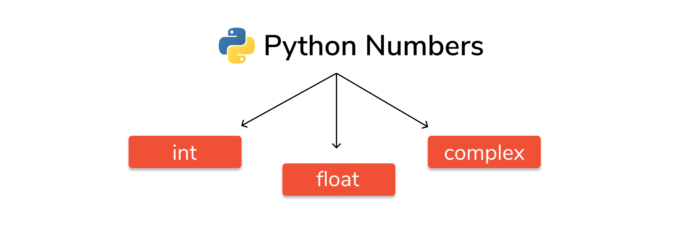

# Python Literals

**Literal** is a raw data given in a **variable** or **constant**. In Python, there are various types of literals they are as follows:

## 1. Numeric Literals

Numeric Literals are **immutable (unchangeable)**. Numeric literals can belong to 3 different numerical types **`Integer`**, **`Float`** and **`Complex`**.



Number data types in Python:

1. Integers: Integer(negative, zero and positive) numbers
   - Example:
       - ... -3, -2, -1, 0, 1, 2, 3 ...


2. Floating Point Numbers(Decimal numbers)
   - Example:
       - ... -3.5, -2.25, -1.0, 0.0, 1.1, 2.2, 3.5 ...


3. Complex Numbers
   - Example:
       - 1 + j, 2 + 3j, 1 - 1j


```python
# Example:

a = 0b1010 #Binary Literals
b = 100 #Decimal Literal
c = 0o310 #Octal Literal
d = 0x12c #Hexadecimal Literal

# Integer Literal
int_1 = 10
int_2 = 99


# Float Literal
float_1 = 10.5
float_2 = 1.5e2


# Complex Literal
x = 3.14j

print(a, b, c, d)
print(int_1, int_2)
print(float_1, float_2)
print(x, x.imag, x.real)
```
```
10 100 200 300
10 99
10.5 150.0
3.14j 3.14 0.0
``` 

In the above program

* We assigned integer literals into different variables. Here, **`a`** is **binary** literal, **`b`** is a **decimal** literal,**`c`** is an **octal** literal and **`d`** is a **hexadecimal** literal.

* When we print the variables, all the literals are converted into **decimal** values.

* **`10.5`** and **`1.5e2`** are **floating point** literals. **`1.5e2`** is **expressed** with **exponential** and is **equivalent** to **`1.5 * 10^2`**.

* We assigned a complex literal i.e **`3.14j`** in variable **`x`**. Then we use **imaginary** literal (x.imag) and **real** literal (x.real) to create imaginary and real part of **complex number**. 

To learn more about Numeric Literals, refer to **Python Numbers**.

### Type Conversion of Numbers in Python

As a programmer, you can convert a variable of any data type to Number data types in Python using the below Python inbuilt functions. Also, using these functions, you can convert a number from one Number data type to another i.e from int to float, float to decimal, decimal to int and so on.

* **`int ()`** : This function converts any data type to integer data type.
* **`float ()`** : This function converts any data type to float data type.
* **`complex (real, imaginary)`** or **`complex (real)`** : This function converts any data type to complex data type.

> **Note**: There is no 'long' integer in Python 3, int and long are unified now. This means int behave more like long. Sample program showing type conversion of Numbers in Python


```python
# Example:

a = 3.7
b = 19.16
c = 3 + 27j

#converting float to int
print (int(b))

#converting int to float
print (float(a))

#converting int to complex
print (complex(a))

#converting float to complex
print (complex(b))

#converting to complex
print (complex(a, b))
```
```
19
3.7
(3.7+0j)
(19.16+0j)
(3.7+19.16j)
``` 

## 2. String literals (unicode character strings)

A **string** literal is a **sequence of characters** surrounded by **quotes**. We can use both **single**, **double** or **triple** quotes for a string. And, a **character literal** is a single character surrounded by single or double quotes.


```python
# Example:

a = '''Apple'''

b = """Apple"""

c = 'Apple'

d = "Apple"

e = Apple     # cannot write string with out quotes ('', " ", """ """, ''' ''')

print(a)
print(b)
print(c)
print(d)
print(e)
```

```python
# Example:

strings = "This is Python"
char = "C"
multiline_str = """This is a multiline string with more than one line code."""
unicode = u"\u00dcnic\u00f6de"
raw_str = r"raw \n string"

print(strings)
print(char)
print(multiline_str)
print(unicode)
print(raw_str)
```
```
This is Python
C
This is a multiline string with more than one line code.
Ünicöde
raw \n string
 ```   

In the above program, 

* **`This is Python`** is a string literal and **`C`** is a **character** literal. 

* The value with **triple-quote """** assigned in the **`multiline_str`** is **multi-line** string literal.

* The **`u"\u00dcnic\u00f6de"`** is a **unicode literal** which supports characters other than English. In this case, **`\u00dc`** represents **`Ü`** and **`\u00f6`** represents **`ö`**.

* **`r"raw \n string"`** is a raw string literal.

## 3. Boolean literals

A Boolean literal can have any of the two values: **`True`** or **`False`**.


```python
# Example:

#REMEMBER  True == 1   False == 0

x = (1 == True)
y = (1 == False)
a = True + 6
b = False + 90

print("x is", x)
print("y is", y)
print("a:", a)
print("b:", b)
```
```
x is True
y is False
a: 7
b: 90
    
```
In the above program, we use boolean literal **`True`** and **`False`**. In Python, **`True`** represents the value as **`1` and `False` as `0`**. The value of `x` is `True` because **`1` is equal to `True`**. And, the value of **`y`** is **`False`** because **`1` is not equal to `False`**.

Similarly, we can use the **`True`** and **`False`** in numeric expressions as the value. The value of **`a`** is **`6`** because we add **`True`** which has value of **`1` with `6`**. Similarly, **`b`** is **`90`** because we add the **`False`** having value of **`0` with `90`**.


```python
# Example:

9.0           # a simple floating point number
1e100         # a googol as floating point number
-1234567890   # an integer
True or False # the two possible boolean values
'This is a string'
"It's another string"
print("""Triple quotes (also with '''), allow strings to break over multiple lines.
Alternatively \n is a newline character (\t for tab, \\ is a single backslash)""")
```
```
Triple quotes (also with '''), allow strings to break over multiple lines.
Alternatively 
 is a newline character (	 for tab, \ is a single backslash)
    
```
Python also has complex numbers that can be written as follows. Note that the **`( )`** brackets or parentheses are required.


```python
complex_number1 = complex(1,2)
print(complex_number1)

complex_number2 = (1.0+2j) # the same number as above
print(complex_number2)
```
```
(1+2j)
(1+2j)
  ```  

## Special literals

Python contains one **special** literal i.e., **`None`**. We use it to specify to that field that is not created.


```python
# Example:

juice = "Available"
soup = None
def menu(x):
    if x == juice:
        print(juice)
    else:
        print(soup)
menu(juice)
menu(soup)
```
```
    Available
    None
  ```  

In the above program, we define a **`menu` function**. Inside **`menu`**, when we set parameter as **`drink`** then, it displays **`Available`**. And, when the parameter is **`food`**, it displays **`None`**.

## Literal Collections

There are four different literal collections **List literals, Tuple literals, Dict literals**, and **Set literals**.


```python
# Example:

fruits1 = ("Banana", "Apple", "Strawberry")             # tuple ()
fruits2 = ["Banana", "Apple", "Strawberry"]             # list []
fruits3 = {"Banana", "Apple", "Strawberry"}             # set {}
fruits4 = {"1":"Banana", "2":"Apple", "3":"Strawberry"} # dictionary {"Key":"Value"}

print(fruits1)
print(fruits2)
print(fruits3)
print(fruits4)
```

```python
('Banana', 'Apple', 'Strawberry')
['Banana', 'Apple', 'Strawberry']
{'Apple', 'Strawberry', 'Banana'}
{'1': 'Banana', '2': 'Apple', '3': 'Strawberry'}


```python
# Example:

fruits = ["apple", "mango", "orange"] #list
numbers = (1, 2, 3) #tuple
alphabets = {'a':'apple', 'b':'ball', 'c':'cat'} #dictionary
vowels = {'a', 'e', 'i' , 'o', 'u'} #set

print(fruits)
print(numbers)
print(alphabets)
print(vowels)
```

```python
['apple', 'mango', 'orange']
(1, 2, 3)
{'a': 'apple', 'b': 'ball', 'c': 'cat'}
{'u', 'e', 'o', 'a', 'i'}

    

In the above program, we created a list of **`fruits`, tuple** of **`numbers`, `dictionary` dict** having values with **keys desginated** to each value and **set** of **`vowels`**.


