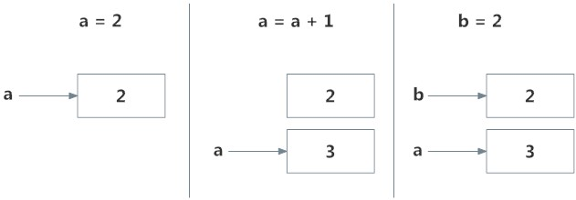

# Python Namespace and Scope

In this tutorial, you will learn about namespace, mapping from names to objects, and scope of a variable.

## What is Name in Python?

If you have ever read 'The Zen of Python' (type **`import this`** in the Python interpreter), the last line states, **Namespaces are one honking great idea -- let's do more of those!** So what are these mysterious namespaces? Let us first look at what name is.

Name (also called identifier) is simply a name given to objects. Everything in Python is an **object**. Name is a way to access the underlying object.

For example, when we do the assignment **`a = 2`**, **`2`** is an object stored in memory and **`a`** is the name we associate it with. We can get the address (in RAM) of some object through the **[built-in function]** **`id()`**. Let's look at how to use it.


```python
# Note: You may get different values for the id

a = 9
print('id(9) =', id(9))

print('id(a) =', id(a))
```

    id(9) = 140708960741424
    id(a) = 140708960741424
    

Here, both refer to the same object **`9`**, so they have the same **`id()`**. Let's make things a little more interesting.


```python
# Note: You may get different values for the id

a = 2
print('id(a) =', id(a))

a = a+1
print('id(a) =', id(a))

print('id(3) =', id(3))

b = 2
print('id(b) =', id(b))
print('id(2) =', id(2))
```
```
    id(a) = 140708960741200
    id(a) = 140708960741232
    id(3) = 140708960741232
    id(b) = 140708960741200
    id(2) = 140708960741200
``` 

What is happening in the above sequence of steps? Let's use a diagram to explain this:

**Memory diagram of variables in Python**:



Initially, an object **`2`** is created and the name a is associated with it, when we do **`a = a+1`**, a new object **`3`** is created and now a is associated with this object.

Note that **`id(a)`** and **`id(3)`** have the same values.

Furthermore, when **`b = 2`** is executed, the new name **`b`** gets associated with the previous object **`2`**.

This is efficient as Python does not have to create a new duplicate object. This dynamic nature of name binding makes Python powerful; a name could refer to any type of object.

```python
  a = 5
  a = 'Hello World!'
  a = [1,2,3]
```

All these are valid and **`a`** will refer to three different types of objects in different instances. **Functions** are objects too, so a name can refer to them as well.


```python
def printHello():
    print("Hello")

a = printHello

a()
```
```
Hello
``` 

The same name **`a`** can refer to a function and we can call the function using this name.

## What is a Namespace in Python?

Now that we understand what names are, we can move on to the concept of namespaces.

To simply put it, a namespace is a collection of names.

In Python, you can imagine a namespace as a mapping of every name you have defined to corresponding objects.

Different namespaces can co-exist at a given time but are completely isolated.

A namespace containing all the built-in names is created when we start the Python interpreter and exists as long as the interpreter runs.

This is the reason that built-in functions like **`id()`**, **`print()`** etc. are always available to us from any part of the program. Each **module** creates its own global namespace.

These different namespaces are isolated. Hence, the same name that may exist in different modules do not collide.

Modules can have various functions and classes. A local namespace is created when a function is called, which has all the names defined in it. Similar, is the case with class. Following diagram may help to clarify this concept.


[](../../img/ns2.png)

## Python Variable Scope

Although there are various unique namespaces defined, we may not be able to access all of them from every part of the program. The concept of scope comes into play.

A scope is the portion of a program from where a namespace can be accessed directly without any prefix.

At any given moment, there are at least three nested scopes.

1. Scope of the current function which has local names
2. Scope of the module which has global names
3. Outermost scope which has built-in names

When a reference is made inside a function, the name is searched in the local namespace, then in the global namespace and finally in the built-in namespace.

If there is a function inside another function, a new scope is nested inside the local scope.

Example of Scope and Namespace in Python

```python
def outer_function():
    b = 30
    def inner_func():
        c = 60

    a = 90
```

Here, the variable **`a`** is in the global namespace. Variable **`b`** is in the local namespace of **`outer_function()`** and **`c`** is in the nested local namespace of **`inner_function()`**.

When we are in **`inner_function()`**, **`c`** is local to us, **`b`** is nonlocal and **`a`** is global. We can read as well as assign new values to **`c`** but can only read **`b`** and **`a`** from **`inner_function()`**.

If we try to assign as a value to **`b`**, a new variable **`b`** is created in the local namespace which is different than the nonlocal **`b`**. The same thing happens when we assign a value to **`a`**.

However, if we declare **`a`** as global, all the reference and assignment go to the global **`a`**. Similarly, if we want to rebind the variable **`b`**, it must be declared as nonlocal. The following example will further clarify this.


```python
def outer_function():
    a = 30

    def inner_function():
        a = 60
        print('a =', a)

    inner_function()
    print('a =', a)


a = 90
outer_function()
print('a =', a)
```
```
    a = 60
    a = 30
    a = 90
    
```
In this program, three different variables **`a`** are defined in separate namespaces and accessed accordingly. While in the following program,


```python
def outer_function():
    global a
    a = 30

    def inner_function():
        global a
        a = 60
        print('a =', a)

    inner_function()
    print('a =', a)


a = 90
outer_function()
print('a =', a)
```
```
    a = 60
    a = 60
    a = 60
``` 

Here, all references and assignments are to the global **`a`** due to the use of keyword **`global`**.

