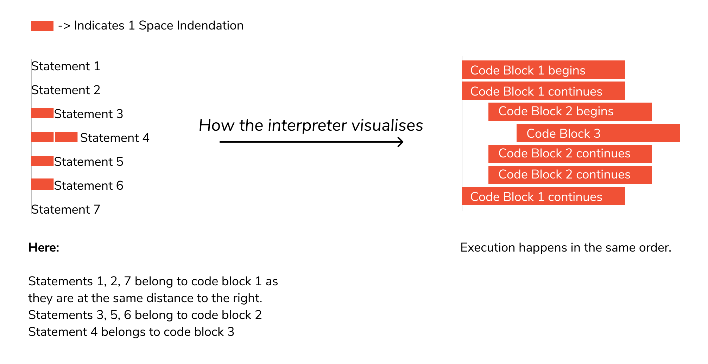

# Python Statement, Indentation and Comments

In this class, you will learn about Python statements, why indentation is important and use of comments in programming.

## 1. Python Statement

Instructions that a Python interpreter can execute are called statements. For example, **`a = 1`** is an assignment statement. **`if`** statement, **`for`** statement, **`while`** statement, etc. are other kinds of statements which will be discussed later.

### Multi-line statement

In Python, the end of a statement is marked by a newline character. But we can make a statement extend over multiple lines with the line continuation character **`\`**.

* Statements finish at the end of the line:
  * Except when there is an open bracket or paranthesis:
  
```python
    1+2
    +3  #illegal continuation of the sum
```
  * A single backslash at the end of the line can also be used to indicate that a statement is still incomplete  
  
```python
    1 + \
    2 + 3 # this is also okay
```

For example:


```python
1+2    # assignment line 1
+3     # assignment line 2

# Python is only calculating assignment line 1
```
```
3
```

```python
1+2 \       # '\' means assignment line is continue to next line
+3
```

**Note:** This would result in error because there should be no comment **`#`** or space after **`\`**.


```python
# Method 1:

1+2 \
+3
```
``` 
6
```

```python
1 + 2 + 3 + \
4 + 5 + 6 + \
7 + 8 + 9
```
```
45
```
This is an explicit line continuation. In Python, line continuation is implied inside:
1. parentheses **`( )`**, 
    For Example:
    ```python
(1+2
             + 3) # perfectly OK even with spaces
```
2. brackets **`[ ]`**, and 
3. braces **`{ }`**. 
For instance, we can implement the above multi-line statement as:


```python
# Method 2:

(1+2
+3)
```
```
6
```

```python
(1 + 2 + 3 +
4 + 5 + 6 +
7 + 8 + 9)
```

```
45
```

Here, the surrounding parentheses **`( )`** do the line continuation implicitly. Same is the case with **`[ ]`** and **`{ }`**. For example:


```python
['red',
'blue',
'green', '99']
```

``` 
['red', 'blue', 'green', '99']
```


## 2. Python Indentation

No spaces or tab characters allowed at the start of a statement: Indentation plays a special role in Python (see the section on control statements). For now simply ensure that all statements start at the beginning of the line.



Most of the programming languages like C, C++, and Java use braces **`{ }`** to define a block of code. Python, however, uses indentation.

A comparison of C & Python will help you understand it better.


A code block (body of a **function**, **loop**, etc.) starts with indentation and ends with the first unindented line. The amount of indentation is up to you, but it must be consistent throughout that block.

Generally, four whitespaces are used for indentation and are preferred over tabs. Here is an example.

**In the case of Python, indentation is not for styling purpose. It is rather a requirement for your code to get compiled and executed. Thus it is mandatory!!!**


```python
for i in range(1,11):
    print(i)   #press "Tab" one time for 1 indentation
    if i == 6:
        break 
```
```
    1
    2
    3
    4
    5
    6
``` 

The enforcement of indentation in Python makes the code look neat and clean. This results in Python programs that look similar and consistent.

Indentation can be ignored in line continuation, but it's always a good idea to indent. It makes the code more readable. For example:


```python
if True:
    print('Hello')
    a = 6
```
``` Hello```
    

or


```python
if True: print('Hello'); a = 6
```

```
Hello 
```
    

both are valid and do the same thing, but the former style is clearer.

Incorrect indentation will result in **`IndentationError`**
.

## 3. Python Comments

Comments are very important while writing a program. They describe what is going on inside a program, so that a person looking at the source code does not have a hard time figuring it out.

You might forget the key details of the program you just wrote in a month's time. So taking the time to explain these concepts in the form of comments is always fruitful.

In Python, we use the hash **`#`** symbol to start writing a comment.

It extends up to the newline character. Comments are for programmers to better understand a program. Python Interpreter ignores comments.

Generally, comments will look something like this:

```python
#This is a Comment
```

Because comments do not **execute**, when you run a program you will not see any indication of the comment there. Comments are in the source code for **humans** to **read**, not for **computers to execute**.


```python
#This is a Comment
```

### 1. Single lined comment:
In case user wants to specify a single line comment, then comment must start with **`#`**.

```python
#This is single line comment.
```


```python
#This is single line comment.
```

### 2. Inline comments
If a comment is placed on the same line as a statement, it is called an inline comment. Similar to the block comment, an inline comment begins with a single hash (#) sign and followed by a space and comment.

It is recommended that an inline comment should separate from the statement at least **two spaces**. The following example demonstrates an inline comment

```python
    n+=1  # increase/add n by 1
```


```python
n=9
n+=1  # increase/add n by 1
n
```
```
10
```


### 3. Multi lined comment:

We can have comments that extend up to multiple lines. One way is to use the hash **`#`** symbol at the beginning of each line. For example:


```python
#This is a long comment
#and it extends
#to multiple lines
```


```python
#This is a comment
#print out Hello
print('Hello')
```
```Hello```
    

Another way of doing this is to use triple quotes, either `'''` or `"""`.

These triple quotes are generally used for multi-line strings. But they can be used as a multi-line comment as well. Unless they are not docstrings, they do not generate any extra code.

```python
#single line comment
print ("Hello Python"
   '''This is
   multiline comment''')
```


```python
"""This is also a
perfect example of
multi-line comments"""
```

```
This is also a\nperfect example of\nmulti-line comments
```


```python
'''This is also a
perfect example of
multi-line comments'''
```


```
This is also a\nperfect example of\nmulti-line comments
```


```python
#single line comment
print ("Hello Python"
'''This is
multiline comment''')
```

```Hello PythonThis is
    multiline comment```
    

### 4. Docstrings in Python

A docstring is short for documentation string.

**Python Docstrings** (documentation strings) are the **string** literals that appear right after the definition of a function, method, class, or module.

Triple quotes are used while writing docstrings. For example:


```
```python
def double(num):
    """Function to double the value"""
    return 3*num
```
Docstrings appear right after the definition of a function, class, or a module. This separates docstrings from multiline comments using triple quotes.

The docstrings are associated with the object as their **`__doc__`** attribute.

So, we can access the docstrings of the above function with the following lines of code:


```python
def double(num):
    """Function to double the value"""
    return 3*num
print(double.__doc__)
```

    Function to double the value


## Help topics

Python has extensive help built in. You can execute **`help()`** for an overview or **`help(x)`** for any library, object or type **`x`**. Try using **`help("topics")`** to get a list of help pages built into the help system.

`help("topics")`


```python
help("topics")
```
```python 
    Here is a list of available topics.  Enter any topic name to get more help.
    
    ASSERTION           DELETION            LOOPING             SHIFTING
    ASSIGNMENT          DICTIONARIES        MAPPINGMETHODS      SLICINGS
    ATTRIBUTEMETHODS    DICTIONARYLITERALS  MAPPINGS            SPECIALATTRIBUTES
    ATTRIBUTES          DYNAMICFEATURES     METHODS             SPECIALIDENTIFIERS
    AUGMENTEDASSIGNMENT ELLIPSIS            MODULES             SPECIALMETHODS
    BASICMETHODS        EXCEPTIONS          NAMESPACES          STRINGMETHODS
    BINARY              EXECUTION           NONE                STRINGS
    BITWISE             EXPRESSIONS         NUMBERMETHODS       SUBSCRIPTS
    BOOLEAN             FLOAT               NUMBERS             TRACEBACKS
    CALLABLEMETHODS     FORMATTING          OBJECTS             TRUTHVALUE
    CALLS               FRAMEOBJECTS        OPERATORS           TUPLELITERALS
    CLASSES             FRAMES              PACKAGES            TUPLES
    CODEOBJECTS         FUNCTIONS           POWER               TYPEOBJECTS
    COMPARISON          IDENTIFIERS         PRECEDENCE          TYPES
    COMPLEX             IMPORTING           PRIVATENAMES        UNARY
    CONDITIONAL         INTEGER             RETURNING           UNICODE
    CONTEXTMANAGERS     LISTLITERALS        SCOPING             
    CONVERSIONS         LISTS               SEQUENCEMETHODS     
    DEBUGGING           LITERALS            SEQUENCES           
````

